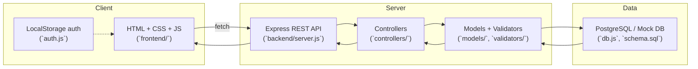

## Architecture Overview

The Coupon Management System is intentionally simple: a static frontend talks to a single Express API, which in turn persists coupon data in PostgreSQL (or an in-memory mock during local demos). The diagram below summarizes the moving parts.

## Data & Request Flow

1. **Login / Signup (frontend only)**  
   - `auth.js` stores user accounts in `localStorage`, seeds demo credentials, and exposes helper methods.  
   - Pages such as `create-coupon.html` call `authStore.requireAuth()` to gate the admin UI.

2. **API Requests**  
   - `frontend/api.js` wraps `fetch` with a base URL (default `http://localhost:4000/api`).  
   - Pages call `window.api.apiGet` / `apiPost`, typically from form submit handlers.

3. **Express Routing (`backend/server.js`, `routes/coupons.js`)**  
   - All endpoints are namespaced under `/api`.  
   - Middleware configures CORS, JSON parsing, and env-driven DB selection.

4. **Controllers & Validation (`controllers/`, `validators/`)**  
   - Controllers map each REST endpoint to business logic (create, list, apply best coupon, mark usage).  
   - Payloads pass through Joi schemas in `validators/validators.js`.

5. **Models & Persistence (`models/couponsModel.js`, `db.js`)**  
   - Models abstract raw SQL queries.  
   - When `USE_MOCK_DB=true`, `db.js` exports an in-memory adapter; otherwise it connects to PostgreSQL using `pg`.

6. **Database (`schema.sql`)**  
   - Tables: `coupons`, `coupon_usage`, plus JSON columns for eligibility rules.  
   - `schema.sql` can be loaded into any Postgres instance; the mock DB mirrors the structure for quick demos.

## Deployment Considerations

- **Frontend**: can be served by any static host (Vercel, Netlify, S3) since it is pure HTML/CSS/JS.  
- **Backend**: Node 18+, single process Express app; environment variables loaded via `dotenv`.  
- **Database**: PostgreSQL 14+ recommended; swap in the mock DB for local or CI runs without Postgres.

## Key Integration Points

- `frontend/api.js` is the only place that knows the backend URL. Override via `window.__API_BASE__` or a `<meta name="api-base">` tag when deploying.
- Auth state is frontend-only today; replacing it with a real backend auth layer would involve:
  - Persisting hashed credentials server-side,
  - Adding `/api/auth/login` endpoints,
  - Storing JWT/HTTP-only cookies instead of `localStorage`.

This document should give new contributors a high-level map before diving into individual files. For setup commands, refer to `RUN_INSTRUCTIONS.md`.

